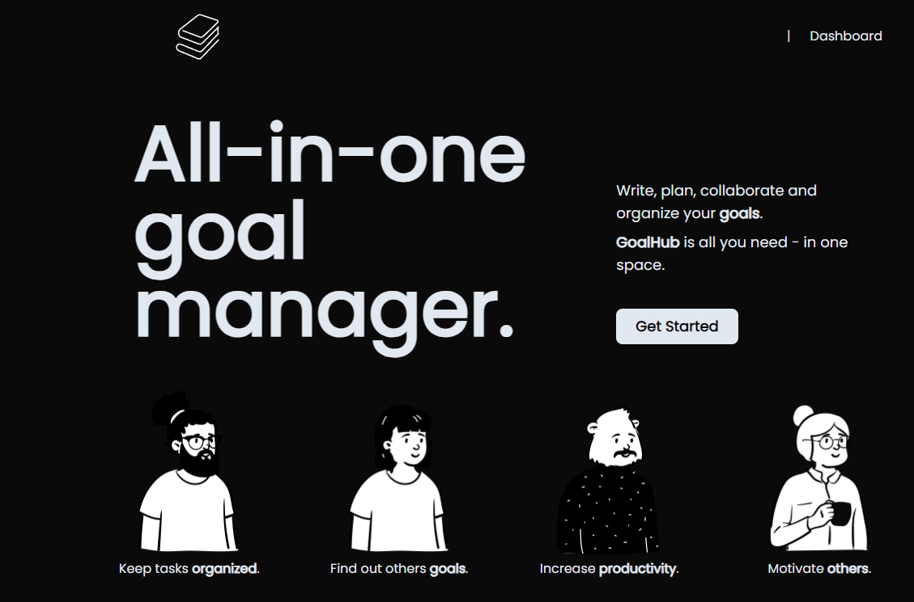
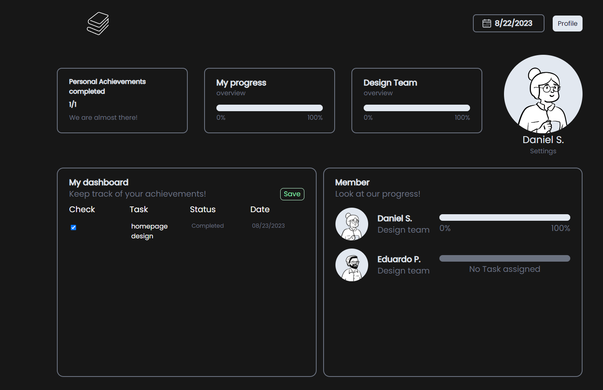
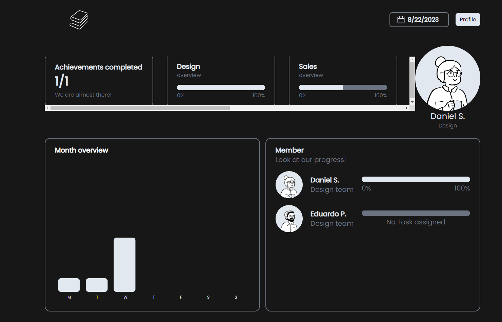
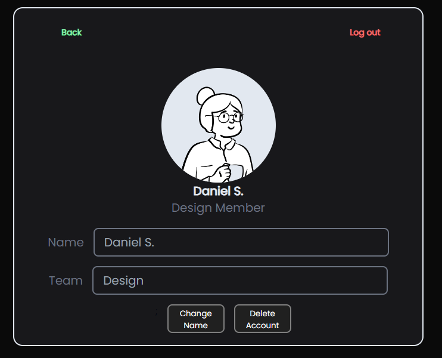

# GoalHub <!-- omit in toc -->

</img>

Empower company employees to track departmental goals and personal achievements within a dynamic social networking platform. With GoalHub, workers can collaborate, share their progress, and celebrate their successes on a weekly basis, fostering a motivated and connected workforce.

 <h2>Dependencies</h2> 

 
    
    
    
    
    
    

## Table of contents <!-- omit in toc -->

- [Description](#description)
  - [Key features](#key-features)
- [Usage](#usage)
  - [Download our project](#download-our-project)
  - [Use existing platform](#use-existing-platform)
- [Mock Up](#mock-up)
- [Credits](#credits)
- [License](#license)
- [Links](#links)

## Description
This web application is designed with company teams in mind. A simple to use, but effective tool, GoalHub allows teams to keep track of daily, weekly & monthly tasks in a way that promotes healthy competition and motivates users to increase productivity, allowing company employees to not only create and assign tasks but also showcase their progress, fostering a more transparent, collaborative, and motivating work environment.

### Key features<!--omit in toc-->
- **Create and assign tasks:** Allow managers to create and assign tasks to employees.
- **Display progress:** Automatically see the number of tasks completed with an easy to read graph.
- **User profiles:** Allow users to see their profile information, such as name & task progression, as well as resetting passwords.
- **Mobile layout:** Access GoalHub on the go! Our platform is fully responsive, ensuring you can check in from any device, anywhere.

## Usage
### Download our project
To use GoalHub, follow these steps:

1. Clone the repository to your local machine.
2. Install the necessary dependencies by running `npm install` in the root directory.
3. Start the server by running `npm start` in the root directory.
4. Navigate to `http://localhost:3000` in your web browser to access the application.
### Use existing platform
GoalHub is also available in our deployed application. [Visit deployment](https://goalhub-5f7766233267.herokuapp.com/)
## Mock Up
The following images demonstrate the functionality of the application.

        <h2>Homepage</h2>
    </img>
        <h2>User Profiles</h2>
    </img>
        <h2>Dashboards</h2>
    </img>
        <h2>Settings</h2>
    </img>

## Credits
| <h3>Name<h3> | <h3>GitHub Profile<h3> | <h3>Role<h3> |
| --- | --- | --- |
| Daniel Sanchez | [Morkendi](https://github.com/Morkendi) | BackEnd
| Alejandro Salazar | [Alexslzr](https://github.com/Alexslzr) | FrontEnd / BackEnd
| Carlos Castillo | [carloscastilloflores](https://github.com/carloscastilloflores) | FrontEnd
| David Mondragon | [mondragonSaiz](https://github.com/mondragonSaiz) | FrontEnd / BackEnd
| Eduardo Pineda | [EduardoPinedaH](https://github.com/EduardoPinedaH) | FrontEnd
| Hector Enrique Vazquez | [Enrique-V06](https://github.com/Enrique-V06) | BackEnd
| Samuel Munguia | [samuel-6](https://github.com/samuel-6) | FrontEnd 

## License

This project utilizes an MIT License.  
[Read more](https://choosealicense.com/licenses/mit/)

## Links
- Link to [GitHub repo](https://github.com/mondragonSaiz/GoalHub)
- Link to [Deployment](https://goalhub-5f7766233267.herokuapp.com/)